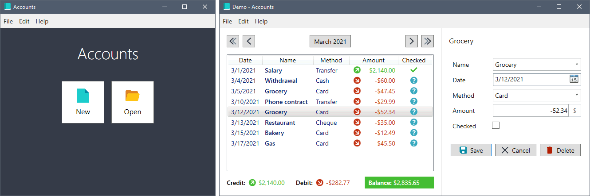

# Accounts


A basic personal financial-accounting software.

## Installation

- Install the [.NET Desktop Runtime](https://dotnet.microsoft.com/download/dotnet/current/runtime/desktop)
- Download the [latest release](https://github.com/GaelGirodon/accounts/releases/latest)
- Extract the archive
- Run `Accounts.exe`

### Using script

```powershell
# Install .NET Desktop Runtime using the link above or dotnet install scripts

# Allow running scripts
Set-ExecutionPolicy RemoteSigned -Scope CurrentUser

# Download and install the latest release of Accounts
Invoke-WebRequest 'https://raw.githubusercontent.com/GaelGirodon/accounts/master/Scripts/Install.ps1' `
 | Invoke-Expression
```

## Features

- Manage an account: add, edit, check and remove transactions
- Navigate in the transactions list by month and year
- Get the account balance and the sum of credits and debits of each month
- Batch duplicate transactions to another date
- Save account transactions to a `.account` file (a simple zipped JSON file)
- Easily create account file backups
- Support many keyboard shortcuts and accelerator keys
- Available in :fr: French and :uk: English



## License

**Accounts** is licensed under the GNU General Public License.
